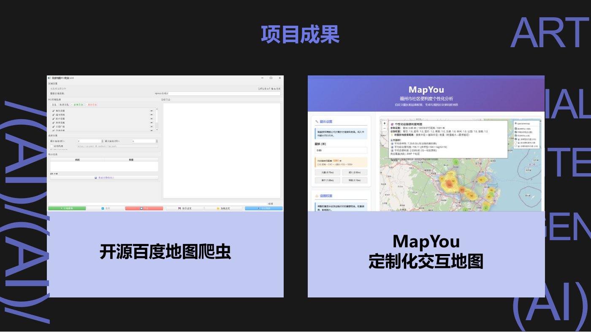
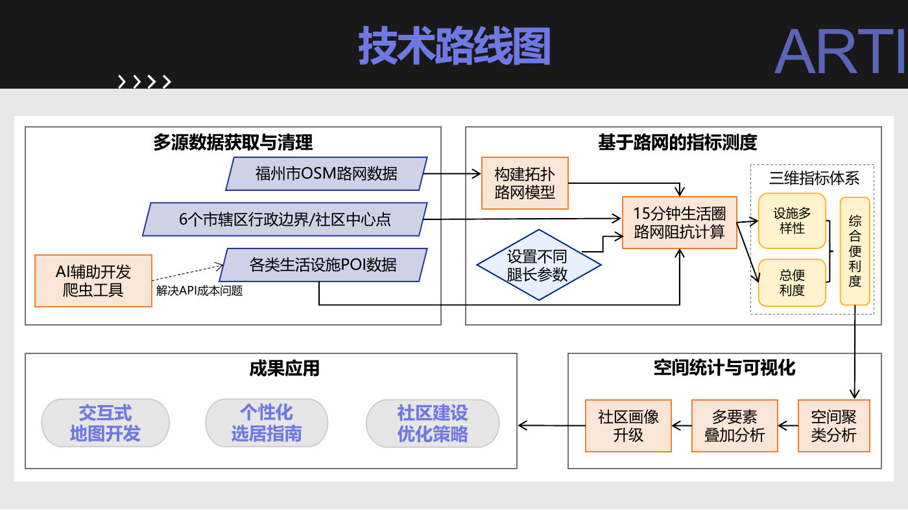

# MapYou · 福州社区便利度交互地图

地理 AI 课程团队项目。围绕“15 分钟生活圈”，串联 POI 采集、坐标转换、路网可达性计算、空间聚类和网页交互，探索设施需求与步行能力差异如何进入社区评价流程。

**课程源码与成果展示仓库，不是生产级导航服务。** 保留原分析逻辑，提供合成数据演示。真实 POI、路网缓存和第三方论文不随仓库分发。已知问题见 [审阅记录](docs/REVIEW.md)。



*课程 PPT 中的原始界面，不是本次重新计算的结果。*

## 项目模块

| 环节 | 工具与内容 | 主要源码 |
| --- | --- | --- |
| 数据采集 | PyQt5、Requests、任务线程、空间筛选、去重与断点保存 | poi_crawler_gui.py、baidu_poi_crawler.py、get_fuzhou_poi.py |
| 坐标处理 | BD-09 / GCJ-02 / WGS-84 转换 | convert_bd09_to_wgs84.py |
| 空间计算 | GeoPandas、NetworkX、KDTree、路网距离与设施统计 | 设施可达性分析.py、设施可达性分析_弗劳德数.py |
| 对照与聚类 | 直线距离、DBSCAN、统计图与热力图 | 设施可达性分析_直线距离.py、设施便利度_空间聚类分析.py |
| 网页交互 | Flask、Folium、HTML/CSS/JavaScript | app.py、templates/interactive_map.html |
| 课程成果 | 去除学号的报告及 15 页汇报 | [reports](reports/) |



## 快速体验

推荐 Python 3.13 和独立虚拟环境。核心依赖在本机 Python 3.13.5 下通过 5 项演示测试，其他环境组合未单独验证。

```bash
git clone https://github.com/Clamsk/mapyou.git
cd mapyou
python -m venv .venv
```

Windows PowerShell 激活：`.\.venv\Scripts\Activate.ps1`。
macOS/Linux 激活：`source .venv/bin/activate`。

```bash
python -m pip install -r requirements.txt
python demo.py
```

打开 http://127.0.0.1:5000 。端口占用时运行 `python demo.py --port 5001`。

演示包含 **49 个虚构路网节点、6 个虚构社区和 32 个虚构设施**，不代表福州真实数据。无需 POI 数据或 API Key；浏览器显示底图和地图组件仍需访问外部资源。

```bash
python -m unittest discover -s tests -v
```

测试覆盖合成数据、首页提示、健康检查、地图接口和已知腿长限制；不代表科学结论通过验证。

## 重要版本差异

- 离线弗劳德数分析和 Flask 服务器是不同实现。离线脚本用腿长换算步行距离；**当前服务器的腿长仅影响显示，未参与设施计数。**
- 服务器使用“基础半径 / max(权重, 0.1)”调整范围。因此零权重不排除设施，也不是常规加权评分。
- 综合分值为“多样性 × 100 + log10(设施数 + 1) × 10”；总便利度另按当前社区样本归一化，不宜跨样本直接比较。
- 演示复用原服务器，没有悄悄替换研究方法。报告描述的预期功能不能当作当前代码的验证结论。

## 真实数据与其他模块

见 [运行说明](docs/USAGE.md)。可选模块依赖见 requirements-full.txt，GUI、采集和打包流程未逐项运行。

数据须由使用者合法准备；app.py 读取项目根目录“输出/”下的路网和 POI 缓存。离线分析可设置 MAPYOU_DATA_DIR。正式 API 脚本从 BAIDU_MAP_AK 环境变量读取凭据，.env.example 不自动加载。

网页采集代码仅作历史审阅，未验证接口当前有效性及许可。使用前应核对服务条款、授权和配额，优先采用获授权接口，不规避访问限制。本次整理未执行采集或请求真实 POI。

## 团队与贡献

- **邱煜**：采集、分析和交互前端的处理流程与方案设计，借助 AI 辅助编写代码，检查算法过程与输出。
- **林佳怡**：主要负责创意、调查层及 PPT 制作汇报。

项目体现地理问题拆解、数据流程设计、空间分析与交互表达能力。AI 辅助编程贯穿实现过程，不声称全部代码脱离 AI 独立编写。本次新增演示、测试和发布文档是后续整理工作，不计作课程当时已有成果。

## 公开范围与安全

包含主要源码、历史说明、脱敏报告/PPT、演示及测试；**不包含**原始 POI、调查记录、GIS 数据库、pickle 缓存、EXE、重复压缩包和第三方论文全文。来源与整理映射见 [清单](docs/source-manifest.json)。

只用于可信本地数据。原服务器输入校验与 HTML 转义不足，pickle 也只可加载自己生成且可信的文件。**不要公网部署，不要上传凭据或受限数据。**

公开展示不等于为第三方数据、图件、模板和全部代码授予开源许可。本次未添加开源许可证，相关权利归对应权利人。
